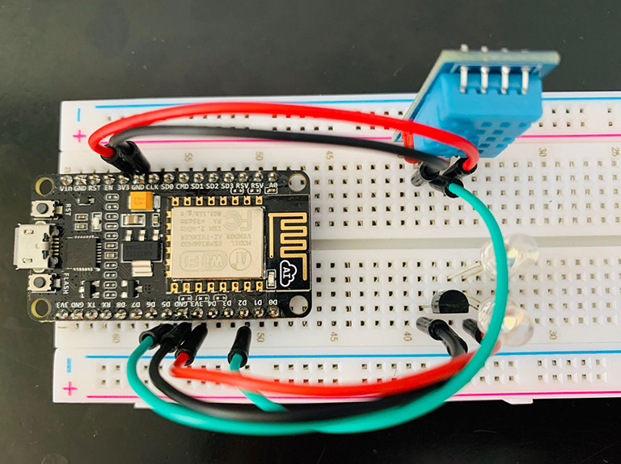

# esp-homekit-ac-remote
使用esp8266 + Homekit通过红外控制空调<br>

# 使用说明
需配合 [esp-homekit-direct](https://github.com/LeeLulin/esp-homekit-direct) 使用，放在 `esp-homekit-direct/devices` 目录下<br>
## 红外解码
红外接收使用了[esp-ir](https://github.com/maximkulkin/esp-ir)<br>
刷写 `firmware` 目录下的 `raw_dumper.bin` 固件，使用串口调试工具接收红外编码<br>
将红外编码复制到 `ir.c` 文件中

## 编译固件
编译之前，需要修改 `config.h` 中的 wifi 配置
```c
#define WIFI_SSID "ssid name"
#define WIFI_PASS "password"
```
编译
```
make -C devices/esp-homekit-ac-remote all
```
刷写 `firmware` 目录下生成的的 `cooler.bin` 固件
# 引脚接线
红外接收：GPIO12(D6)<br>
红外发射：GPIO14(D5)<br>
DHT11温湿度传感器：GPIO4(D2)<br>



# 感谢
[esp-ir](https://github.com/maximkulkin/esp-ir)<br>
[esp-homekit](https://github.com/maximkulkin/esp-homekit)<br>